:::note
**`Here are all the experimental outputs and figures we have run`**
:::

## Experiment 1
### Goal
Identify the improvement in performance over time for a single subject not present in the training dataset using active and semi-supervised learning methods.

#### Training Set

- *Baseline*: Data from all of the subjects except subject `i` to build a baseline model, where the subject `i` is the test subject.
- *Personalization*: Subject `i` data split using a 70:30 split of the dataset. 70% split is taken as unlabeled data from subject `i` and subsets from this would be added to traning set at each round.

#### Test Set
- 30% subset of the data from the subject `i`, which is the golden test data that never be added to the traning data set.

### Figures for comparison of different methods
 
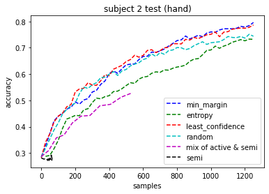 
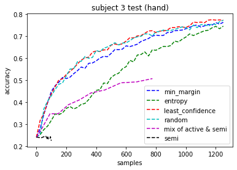 
 
 
 
 
 
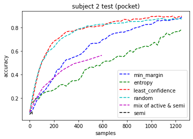 
 
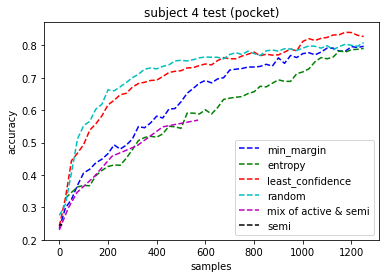 
 
 
 

### Figures for comparison of different subjects using a specific method
 

 
 

 
 

 
 

### Figures for impact of number of training subjects on personalization
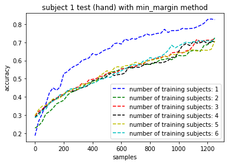 
 
 
 
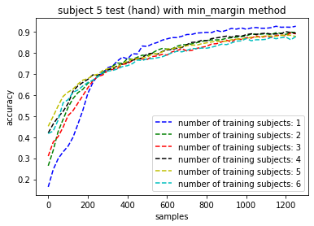 
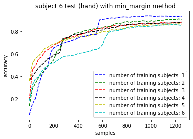 
 
 
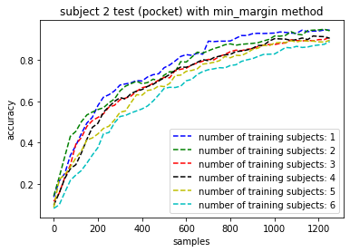 
 
 
 
 
 
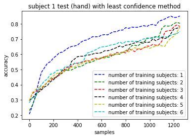 
 
 
 
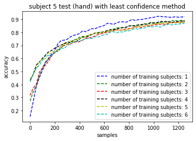 
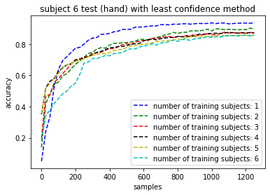 
 
 
 
 
 
 
 
 

## Experiment 2
Subject `i` hand and pocket data split using a 70:30 split of the dataset

### Goal
Identify how can a classifier be adapted to account for sensor placement variations for a single individual subject

#### Training Set
- *Baseline*: 70% Hand data of a specific subject `i` 
- *Adaptation*: subsets from 70% pocket data of a specific subject `i`

#### Test Set
- 30% subsets of hand data and pocket data of a specific subject `i`

### Figures for comparson of different placements
 

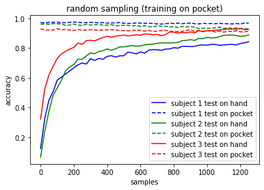 
 
 
 
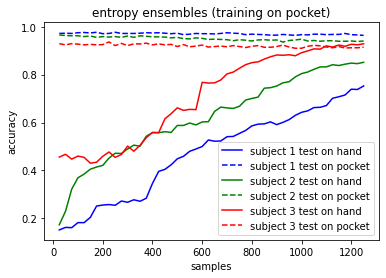 
 
 
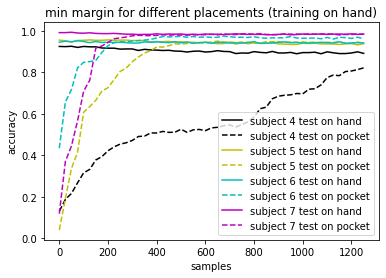 
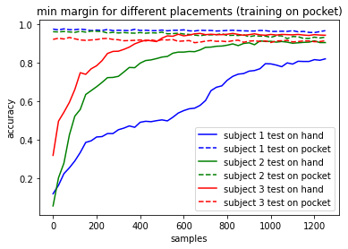 
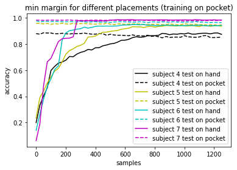 
 
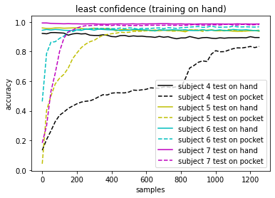 
 
  
