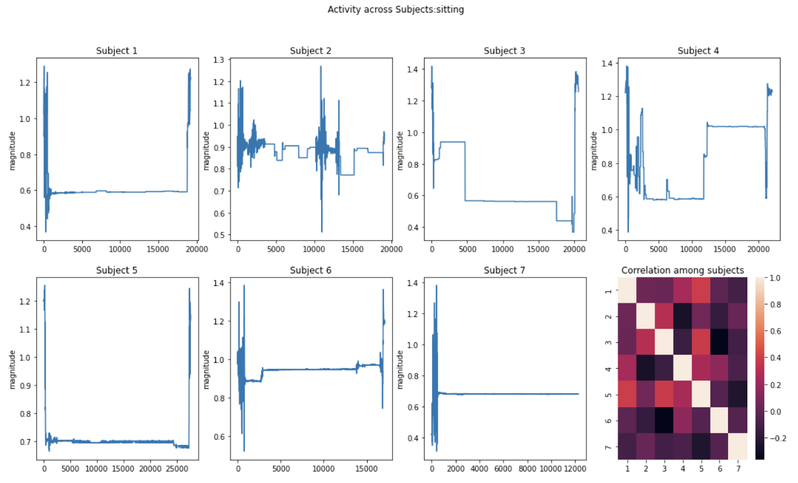
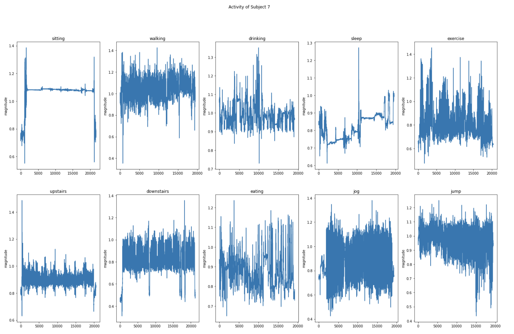

We performed an initial exploration from the data collected, the dataset has the accelerometer x,y and z signals from which we computed the magnitude of the raw accelerometer signals and performed this exploratory analysis.

First, we look at the magnitude of some of the activities across the subjects. We consider three activities randomly selected at two different sensor placements, we plot the magnitude as well as correlation between the magnitude of accelerometer signals across subjects.

### Sensor placement 1 : Phone in hand

The plots below show walking activity, for the 7 subjects. We can see that activity like walking varies based on how each individual subject walks, either fast or slow. In addition to this it also varies with which hand or the position in which they held their phone while recording the data. There is very little correlation between the signals as shown in the heat map, which indicates that the walking pattern of each individual can different.

Next we plot the sleeping and sitting position activity, here we can see a minor pattern emerging this can be due to the fact that little movement is observed while recording sitting activity. This also implies that sitting and sleeping could be generalized better compared to other activities. The correlation plot also reflects this, with high correlation across subjects for sitting and sleeping activities.

### Sensor placement 2 : Phone in pocket 

Similar to the previous exploration, we plot the magnitude for the mobile phone placed in the subject’s pocket. We find similar observations, for sitting and sleeping activity there is a correlation between the subjects indicating that sensor placement does not matter here because there is not much movement from the subjects. However when we look at the jogging activity we find very little correlation in the signals across subjects.

The below plot shows the 10 activity recorded for a single subject(subject 7) with phone in hand and no supervision. This plot is to show the signal variations across different activities.

