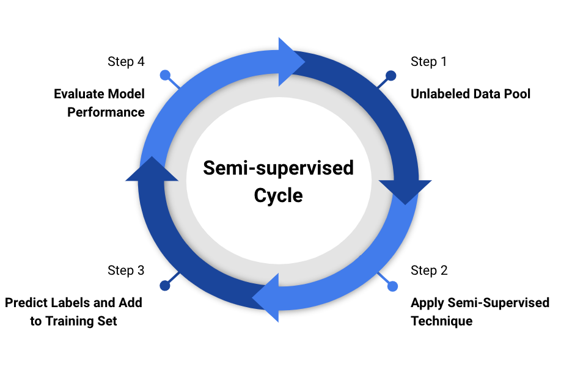

As we know, the pipeline for activity recognition is as shown below, and we have discussed the dataset collection in the previous section.

### Feature Extraction 

We move on to the next step which is **frame** and **feature extraction**.  We perform basic preprocessing to drop samples in the start and end of the data for each activity for all subjects. The frames are extracted for a window of **100ms** with **50ms overlapping** frames. Since our goal is to study personalization, we did not experiment on different frame sizes. The data is recorded at **100Hz** hence we selected 100ms frames with 50% overlap. We have used time-domain features that have worked well in previous work designed for accelerometer data. We believe that since the accelerometer signals are captured in time domain, these features are sufficient to model the activities. 

We extracted the following features for each `frame, mean, variance, standard deviation, median, third and fourth moment, 25,50 and 75 percentile, skewness, kurtosis and rms of signal`. We obtain the above features for the raw accelerometer signals along X,Y and Z axis as well as the magnitude signal. In total we get 48 features. The choice of these features are based upon previous works as well as assignments in class. 

| Features Extracted        |      Number of Features      |
| ------------------------- | :--------------------------: |
| Mean                      |   4 (AccX,AccY,AccZ,MagAcc)  |
| Median                    |   4   |
| Variance                  |   4    |
| Standard Deviation        |   4   |
| Third Moment              |   4   |
| Fourth Moment             |   4   |
| 25th Percentile           |   4   |
| 50th Percentile           |   4   |
| 75th Percentile           |   4   |
| Skewness                  |   4   |
| Kurtosis                  |   4   |
| RMS                       |   4   |
| **Total**                     |              48              |

Once we obtain the features, we train our baseline models, this is discussed in detail in the next section. We use a **RandomForestClassifier** as the machine learning model. The choice of RandomForestClassifier is from prior literature review as well as widespread use of ensembling methods. Ensemble methods help to achieve the `bias-variance tradeoff`. When the **number of estimators** *increases* the **variance** can be reduced, by averaging out across the different base learners(decision tree). In addition to this random forest identifies **different subsets of features** to train the different base learners thereby **preventing overfitting**.

## Active learning 

We identify the most informative samples or the samples where the model is uncertain about it’s prediction and use a pool-based strategy to query for these samples. The setup for this is, there is a set of labeled instances, a set of unlabeled instances, and a golden oracle which provides the label for an unlabeled instance when queried. During each iteration we find the instance which we want the oracle to label using different query strategies and then add them to the labeled pool to retrain the model and evaluate them. In this way the model starts to gradually learn from the additional samples provided.

The main query strategies which we analyzed are based on Uncertainty sampling. The usefulness of a instance is calculated based on different measures like classification uncertainty, classification margin and classification entropy. We briefly explain the measures below, 

### Ensembling with entropy 

In this method, we use two models (RandomForest and MLPClassifier) to train a classifier and then evaluate the predictions of both the classifiers on the unlabeled instance.  Then we measure the **entropy in the probability distribution of the predictions** from the two models. This shows if the unlabeled instance has a different probability distribution from one model to another which indicates uncertainty.

### Least confidence

This is one of the simplest methods to measure the uncertainty. We do this by measuring the prediction probability from the model, and select the samples whose **confident predictions are less than 0.5** as uncertain. This implies that the model is able to predict the class only with 0.5 probability making it uncertain.

### Minimum margin 

The most intuitive form of uncertainty sampling is the difference between the two most confident predictions. We measure this by identifying for the label that the model predicted, how confident is this prediction than the next most confident label prediction by the model. In other words it measures the **difference in confidence between the first and second most likely predictions**. 

### Random sampling

For random sampling, we add **randomly selected samples** from the unlabeled pool without any criterion and to the labeled set.

## Semi-supervised learning

The major difference between active learning and semi-supervised learning is that the latter uses the unlabeled examples for improving the accuracy whereas active learning approaches query an oracle to label the data.

The goal of the semi-supervised approach is to understand whether we can label the unlabeled samples from the model and use it to retrain the model. For this method, we have a set of labeled instances, a set of unlabeled instances, and a test set.

We implement self-training which makes use of a model’s own prediction on unlabeled data in order to obtain additional information that can be used during training. The basic idea is to build a model on the labeled data and then use this model to estimate the labels for the unlabeled pool. The most confident label values are taken and the newly labeled data are then used along with the originally labeled instances to retrain the model. This procedure is repeated until all samples are labeled.

However, semi-supervised learning is not able to obtain enough new samples to retrain the model if we select only the samples with high confidence. We implement a mixed strategy consisting of active and semi- supervised, where at each iteration we sample uncertain samples and query the oracle for the labels to add to the training data and then use another set of instances, identify their predictions in a self-training manner and then add the most confident predictions to the training dataset with the predicted labels as the actual labels.
