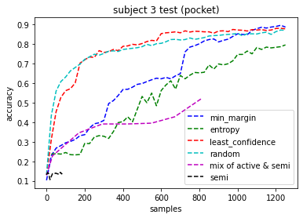
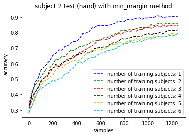
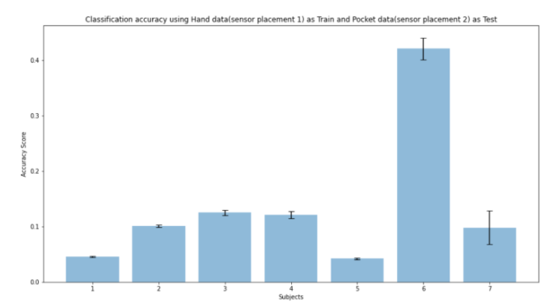
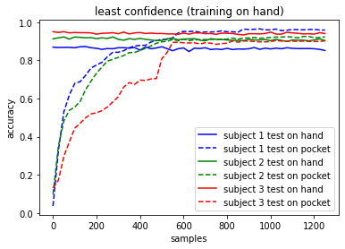

## Experiment 1
### Goal
Identify the improvement in performance over time for a single subject not present in the training dataset using active and semi-supervised learning methods.

### Baseline
Obtain the baseline model for hand and pocket data using `Leave One Subject Out(LOSO)` and `hold out` validation separately. The classifier we decide to use is **RandomForest**.
- We train a model with hand data only and evaluate using LOSO. 
- In order to justify the poor performance of LOSO, we also evaluate using hold out validation(subject dependent). i.e. we train only on Subject 1 and test on Subject 1 data using a 70:30 split of the dataset. Similarly for all the other subjects as well.
- We perform the same set of experiments using pocket data.
- Each of the models are trained 5 times to account for **variance in evaluation**, we have plotted the error bars to show the variance in the accuracy score across **5 different runs** of the model.
- The results are as shown below:
 

Unsurprisingly, the **performance of hold-out is much better** than that of LOSO as basically each individual activities are uncorrelated. It is hard to predict one subject's activities correctly using other subject's data.

### Personalization Setup
To reiterate we have obtained our baseline using LOSO as discussed above, next we move on to active learning. In active learning, we expand our training data set using different query methods. That means we convert some unlabeled instances to labeled instances and add them to the training set by various criterions. After that, we retrain the model and test to get the updated accuracy results. It simulates continually learning from the activities of the individual subject over time. 

:::note

Experimental parameters : we specify the number of iterations as 50, and the batch size for each iteration is 25. i.e In each iteration, we perform active learning with various criterions to select 25 instances from unlabeled data pool.

::: 

#### Training Set

- *Baseline*: Data from all of the subjects except subject `i` to build a baseline model, where the subject `i` is the test subject.
- *Personalization*: Subject `i` data split using a 70:30 split of the dataset. 70% split is taken as unlabeled data from subject `i` and subsets from this would be added to traning set at each round.

#### Test Set
- 30% subset of the data from the subject `i`, which is the golden test data that never be added to the traning data set.

### Results
First, the total number of instances after feature extraction for each subject is listed below:

| Category    |      Subject      |   Total number of instances  | Number of Golden Test instances | Number of unlabeled instances in the pool|
| ------------| :---------------: | :-------------------------:  | :-------------------------:     | :-------------------------:              |
| hand        |   1               |   3769                       |		1243					   |    2526								  |
| hand        |   2               |   3311                       |		1092				       |	2219                                  |
| hand        |   3               |   3637                       |		1200					   |    2437                                  |
| hand        |   4               |   4015						 |		1324					   |    2691                                  |
| hand        |   5               |   4376						 |		1444					   |    2932                                  |
| hand        |   6               |   3983						 |		1314					   |    2669                                  |
| hand        |   7               |   4007						 |      1322                       |    2685                                  |
| pocket      |   1               |   2991						 |       987                       |    2004                                  |
| pocket      |   2               |   2785						 |       919                       |    1866                                  |
| pocket      |   3               |   2991						 |       987                       |    2004                                  |
| pocket      |   4               |   3215						 |      1060                       |    2155                                  |
| pocket      |   5               |   3486						 |      1150                       |    2336                                  |
| pocket      |   6               |   3352						 |      1106                       |    2246                                  |
| pocket      |   7               |   3590						 |      1184                       |    2406                                  |

It is as expected that the **accuracy increases** as more labeled instances are added to the training set. In the comparison of different query methods, our experimental results show that the `active learning with least confidence` has the **best performance**, achieving **70%-80%** accuracy when **20%** of all original unlabeled data are added (500 out of 2500 samples) while the semi-supervised learning has the worst performance. 

Furthermore, semi-supervised learning is **not** able to obtain **enough new samples** to retrain the model if we select only the **samples with high confidence**. Therefore, we use the `combination of active learning and semi-supervised learning` instead. But it still gets worse performance compared to other methods. The reason could be that the baseline classifier has a bad recognition rate, and it causes too many **wrongly labeled data** to be added to the training data set. Besides, one interesting result we obtain is that we can get a good result even if we just randomly query the unlabeled data during the initial iterations. This is because the model has not seen sufficient samples yet from the particular subject hence increase in the performance.

 

 

On the other hand, we also compared the performance of different sensor placements under a specific query method for each subject. The result shows that for each subject, we can get **better performance with training and testing a model on pocket than on hand**. This is reasonable since putting smartphone in pocket limits more to some extent the degree of freedom of the movement of a smartphone on pocket than on hand. Therefore, we can get a more similar pattern for different subjects on the pocket, and it becomes easier to personalize the model.

 

 

Furthermore, We also study the impact of the number of training subjects on the performance: As expected, the performance became worse with more training subjects used to build the original model. That means it is more difficult to adapt to the model when more other people’s data is considered in the training model. 

 

 

In order to understand this claim better let's look at a specific example below, for training with **1-3 subjects** we can see that the **baseline performance is low** on the right plot and with more training data the baseline performance is higher. Whereas when we look at the performance of the model after adding the **1200 samples** using active learning the one with less training data(*blue,green and red dotted line*) on the left plot is able to personalize better. This is an interesting observation and indicates a tradeoff between baseline performance vs personalization.

## Experiment 2
### Goal
Identify how can a classifier be adapted to account for sensor placement variations for a single individual subject

### Baseline
We obtain baseline model for training on hand data of each subject separately and testing on pocket data of that corresponding subject with a RandomForest classifer. This becomes the baseline for Experiment 2 where we try to build a robust classifier to account for sensor placement variations for individual subjects. We can see that the performance of the classifier is very low as shown in the plot, which is expected because when we train a model to recognize activity by recording data with mobile phone on hand from a single subject and then test it on data recorded with mobile phone in pocket, the accuracy is bound to be low.

### Adaptation Setup

We keep expanding the training set and retrain the model by adding more pocket data using active learning and semi-supervised learning, and observe the variation on both pocket/hand test data sets.

:::note

Experimental parameters : we specify the number of iterations as 50, and the batch size for each iteration is 25. i.e In each iteration, we perform active learning with various criterions to select 25 instances from unlabeled data pool.

::: 

Subject `i` hand and pocket data split using a 70:30 split of the dataset

#### Training Set
- *Baseline*: 70% Hand data of a specific subject `i` 
- *Adaptation*: subsets from 70% pocket data of a specific subject `i`

#### Test Set
- 30% subsets of hand data and pocket data of a specific subject `i`

### Results
We can observe that the performance of placement on hand remains stably high as more unlabeled pocket data is converted to labeled data and added to the training set. On the other hand, we can also observe that the performance of a personalized classifier would increase exponentially at first, and then reach an upper bound close to the other placement when a certain number of training data are newly added. It indicates that we can adapt a classifier with active learning to get a good performance of activity recognition even if the placement changes.

 

 
